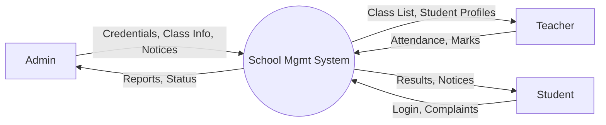
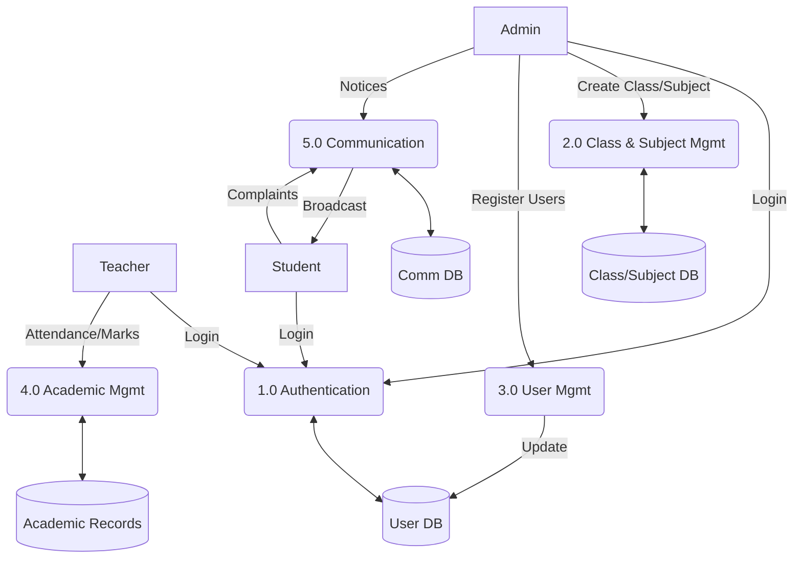
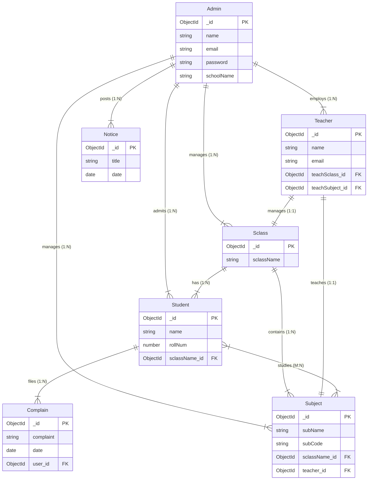

# PPT Presentation Content: School Management System

This document provides the structured content for your Level-1 PPT presentation. You can copy these points directly into your slides.

---

## Slide 1: Project Title
**Project Title:** SchoolSync  
**Subtitle:** The Complete Digital Solution for Modern Education  
**Presented by:** [GOPAL KUMAR SINGH]  
**Technology Stack:** MongoDB, Express.js, React.js, Node.js

---

## Slide 2: Introduction and Objective
### Introduction
The School Management System is a comprehensive web-based application designed to digitize and automate the day-to-day operations of educational institutions. It provides a centralized platform for administrators, teachers, and students to interact seamlessly.

### Objectives
- **Digital Transformation:** Convert manual record-keeping into a secure digital database.
- **Efficiency:** Streamline attendance tracking, grading, and scheduling.
- **Transparency:** Provide real-time access to performance data for students and parents.
- **Communication:** Facilitate easy broadcasting of notices and feedback collection.

---

## Slide 3: SRS (System Requirement Specification)
### Functional Requirements
- **User Authentication:** Secure JWT-based login for Admin, Teacher, and Student roles.
- **Dashboard Management:** Role-specific dashboards with relevant analytics.
- **Attendance System:** Session-based attendance tracking with automated percentage calculation.
- **Performance Tracking:** Exam result management and graphical performance analysis.

### Non-Functional Requirements
- **Security:** Password hashing (Bcrypt), JWT authentication, and Role-Based Access Control (RBAC).
- **Responsiveness:** Modern Glassmorphism UI that works on Mobile, Tablet, and Desktop.
- **Scalability:** Optimized MongoDB queries to handle large student/teacher datasets.

---

## Slide 4: Process Logic
The system follows a hierarchical flow:
1.  **Admin Initialization:** Admin registers the school and creates classes and subjects.
2.  **Entity Management:** Admin enrolls Teachers and Students into specific classes.
3.  **Academic Cycle:** 
    - Teachers mark attendance and upload exam marks for their assigned subjects.
    - Students view their attendance, results, and school notices.
4.  **Feedback Loop:** Students can submit complaints which are reviewed by the Admin.

---

## Slide 5: Gantt Chart (3-Month Timeline)
1. **Phase 1: Planning (Weeks 1-2)**
   - Requirement Gathering
   - System Design & SRS
2. **Phase 2: Backend Development (Weeks 3-6)**
   - Database Modeling (MongoDB)
   - API Development (Node/Express)
3. **Phase 3: Frontend Development (Weeks 7-10)**
   - UI/UX Design (Material UI)
   - Frontend Integration (React)
4. **Phase 4: Testing (Weeks 11-12)**
   - Unit & Integration Testing
5. **Phase 5: Deployment (Final week)**
   - Deployment & Documentation

---

## Slide 6: Data Flow Diagrams (DFD)

### Level 0 DFD (Context Diagram)

**Description:** Represents the entire system as a single process interacting with external entities.
- **Process 0.0:** School Management System
- **External Entities:** Admin, Teacher, Student
- **Flows:**
    - **Admin** splits into system: *Credentials, Class Details, Subject Info, Notices*
    - **Teacher** inputs to system: *Daily Attendance, Exam Marks*
    - **Student** inputs to system: *Login Details, Complaints*
    - **System** returns to **Admin**: *Statistical Reports, System Status*
    - **System** returns to **Teacher**: *Class List, Student Profiles*
    - **System** returns to **Student**: *Academic Results, Attendance Status, Notices*

### Level 1 DFD (Process Breakdown)

**Description:** Decomposes the main system into major functional modules.
1.  **1.0 Authentication Process:**
    - Inputs: Login Credentials (All Users)
    - Logic: Validate against User DB (Encrypted Passwords)
    - Outputs: Auth Token (JWT), Dashboard Access
2.  **2.0 Class & Subject Management (Admin):**
    - Inputs: Class Name, Subject Code
    - Data Store: `Sclass Collection`, `Subject Collection`
    - Outputs: Created Classes/Subjects list
3.  **3.0 User Management (Admin):**
    - Inputs: Teacher/Student Details
    - Data Store: `Teacher Collection`, `Student Collection`
    - Outputs: Registered Users
4.  **4.0 Academic Management (Teacher):**
    - Inputs: Attendance Status, Exam Marks
    - Data Store: `Teacher Collection` (Attendance Sub-doc), `Student Collection` (Marks Sub-doc)
    - Outputs: Updated Academic Records
5.  **5.0 Communication Module:**
    - Inputs: Notices (Admin), Complaints (Student)
    - Data Store: `Notice Collection`, `Complain Collection`
    - Outputs: Broadcasted Notices, Resolved Complaints

### Level 2 DFD (Focus: Academic Management Process 4.0)
**Description:** Detailed look at how a Teacher manages academics.
- **4.1 Fetch Class List:** Teacher requests student list -> System queries `Student Collection` -> Returns List.
- **4.2 Mark Attendance:** Teacher submits status (Present/Absent) -> System updates `Student` attendance array & `Teacher` record.
- **4.3 Upload Marks:** Teacher inputs marks for Subject -> System calculates grade -> Updates `Student` examResult array.
- **4.4 Generate Analytics:** System aggregates data -> System generates visual performance graph -> Displayed to Student/Teacher.

---

## Slide 7: Entity-Relationship (ER) Diagram

### Entities & Attributes
1.  **Admin (School Representative)**
    - **PK:** `_id` (ObjectId)
    - **Attributes:** `name`, `email`, `password`, `schoolName`
2.  **Sclass (Class)**
    - **PK:** `_id`
    - **Attributes:** `sclassName`, `school_id` (FK)
3.  **Subject**
    - **PK:** `_id`
    - **Attributes:** `subName`, `subCode`, `sessions`, `sclassName_id` (FK), `school_id` (FK), `teacher_id` (FK)
4.  **Teacher**
    - **PK:** `_id`
    - **Attributes:** `name`, `email`, `password`, `teachSclass_id` (FK), `teachSubject_id` (FK), `school_id` (FK), `attendance[]`
5.  **Student**
    - **PK:** `_id`
    - **Attributes:** `name`, `rollNum`, `password`, `sclassName_id` (FK), `school_id` (FK), `attendance[]`, `examResult[]`
6.  **Notice**
    - **PK:** `_id`
    - **Attributes:** `title`, `details`, `date`, `school_id` (FK)
7.  **Complain**
    - **PK:** `_id`
    - **Attributes:** `user_id` (FK), `complaint`, `date`, `school_id` (FK)

### Relationships & Cardinality
1.  **Admin ↔ Teacher (One-to-Many):**
    - A single School (Admin) employs multiple Teachers.
    - *Cardinality:* `1 : N`
2.  **Admin ↔ Student (One-to-Many):**
    - A single School (Admin) admits multiple Students.
    - *Cardinality:* `1 : N`
3.  **Sclass ↔ Student (One-to-Many):**
    - One Class Section (e.g., Class 10-A) contains multiple Students.
    - *Cardinality:* `1 : N`
4.  **Sclass ↔ Subject (One-to-Many):**
    - One Class has multiple Subjects defined for its curriculum.
    - *Cardinality:* `1 : N`
5.  **Teacher ↔ Sclass (One-to-One):**
    - A Teacher is assigned as a Class Teacher to exactly one Class.
    - *Cardinality:* `1 : 1`
6.  **Teacher ↔ Subject (One-to-One):**
    - A Teacher is assigned to teach exactly one specific Subject.
    - *Cardinality:* `1 : 1`
7.  **Student ↔ Complain (One-to-Many):**
    - A Student can register multiple complaints over time.
    - *Cardinality:* `1 : N`
8.  **Student ↔ Subject (Many-to-Many):**
    - A Student studies multiple Subjects, and a Subject is studied by multiple Students (represented via Class enrollment).
    - *Cardinality:* `M : N`

---

## Slide 8: Data Dictionary
| Table | Key Field | Data Type | Description |
| :--- | :--- | :--- | :--- |
| **Admin** | `schoolName` | String | Unique name of the institution |
| **Student** | `rollNum` | Number | Unique identifier for student in a class |
| **Teacher** | `teachSubject` | ObjectId | Reference to the Subject taught |
| **Subject** | `subCode` | String | Unique code for the subject |
| **Attendance** | `status` | Enum | 'Present' or 'Absent' |
| **Notice** | `date` | Date | Date of notice publication |

---

## Slide 9: Interface
- **Theme:** Modern Glassmorphism (Frosted glass effect).
- **Frameworks:** Material-UI (MUI) for professional UI components.
- **Responsiveness:** Grid-based layout for cross-device compatibility.
- **Animations:** Smooth transitions using Framer Motion.
- **Navigation:** Sidebar for Desktop and Bottom-nav/Hamburger for Mobile.

---

## Slide 10: Interface (UI Screens)
- Login Page
- Admin Dashboard
- Teacher Dashboard
- Student Dashboard
- Attendance Page
- Result Page

---

## Slide 11: Expected Report Generation
- **Attendance Report:** Monthly/Subject-wise attendance percentage for students.
- **Result Cards:** Individualized digital mark sheets for each semester/exam.
- **Class Statistics:** Comparison of performance across different sections.
- **Complaint Summary:** Overview of resolved vs. pending student grievances.

---

## Slide 12: References
1.  **MERN Stack Documentation:** [mongodb.com](https://www.mongodb.com/), [expressjs.com](https://expressjs.com/), [react.dev](https://react.dev/), [nodejs.org](https://nodejs.org/)
2.  **UI Library:** [Material-UI (MUI)](https://mui.com/)
3.  **Authentication:** [JSON Web Token (JWT) Docs](https://jwt.io/)
4.  **Charts:** [Recharts Library](https://recharts.org/)

---

## Slide 13: Future Scope
- **AI Analytics:** Predict student performance trends using machine learning.
- **Parent Portal:** Dedicated login for parents to track their child's progress.
- **Online Exams:** Integrated platform for hosting and grading online assessments.
- **Mobile App:** Native iOS and Android applications for better accessibility.
- **Payment Gateway:** Online fee payment and management module.
